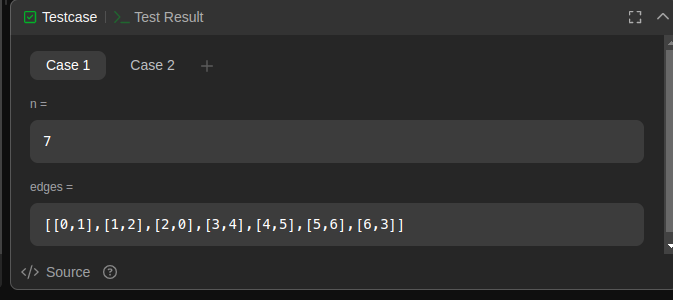
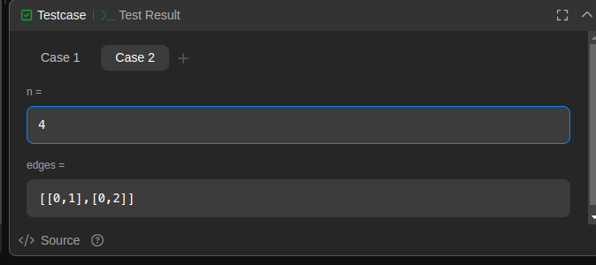

## [2608. Ciclo Mais Curto em um Grafo](https://leetcode.com/problems/shortest-cycle-in-a-graph/description/)

Você está dado um grafo bidirecional com \( n \) vértices, onde cada vértice é rotulado de \( 0 \) a \( n - 1 \). As arestas do grafo são representadas por um dado array 2D de inteiros, onde `edges[i] = [ui, vi]` denota uma aresta entre os vértices \( u_i \) e \( v_i \). Cada par de vértices está conectado por no máximo uma aresta, e nenhum vértice possui uma aresta para ele mesmo.

Retorne o comprimento do ciclo mais curto no grafo. Se não existir ciclo, retorne -1.

Um ciclo é um caminho que começa e termina no mesmo nó, e cada aresta no caminho é usada apenas uma vez.

## Exemplos

**Exemplo 1:**

Entrada:  
\( n = 7 \),  
\( edges = [[0,1],[1,2],[2,0],[3,4],[4,5],[5,6],[6,3]] \)

Saída:  
\( 3 \)

Explicação: O ciclo com o comprimento mínimo é: \( 0 \rightarrow 1 \rightarrow 2 \rightarrow 0 \).

**Exemplo 2:**

Entrada:  
\( n = 4 \),  
\( edges = [[0,1],[0,2]] \)

Saída:  
\( -1 \)

Explicação: Não há ciclos neste grafo.

## Restrições:

- \( 2 \leq n \leq 1000 \)
- \( 1 \leq \text{edges.length} \leq 1000 \)
- \( \text{edges[i].length} = 2 \)
- \( 0 \leq u_i, v_i < n \)
- \( u_i \neq v_i \)
- Não há arestas repetidas.

## Screenshots da Solução

Solução da questão 2608

Case 1

Case 2

### [Código da Solução](code_2608.py)