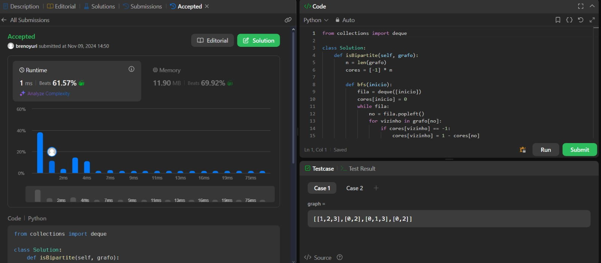
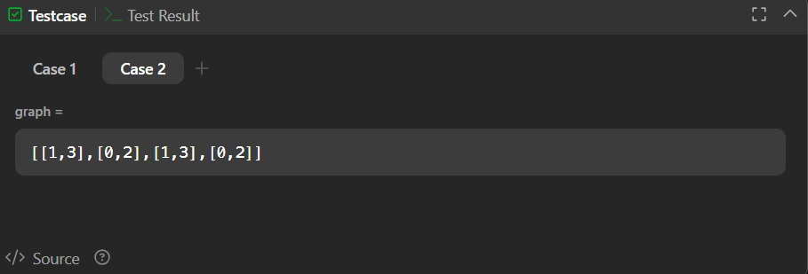

# [785. O Grafo é Bipartido?](https://leetcode.com/problems/is-graph-bipartite/description/)

Há um grafo não direcionado com \( n \) nós, onde cada nó é numerado entre 0 e \( n - 1 \). Você recebe um array 2D graph, onde graph[u] é um array de nós aos quais o nó \( u \) está adjacente. De forma mais formal, para cada \( v \) em graph[u], existe uma aresta não direcionada entre os nós \( u \) e \( v \). O grafo possui as seguintes propriedades:

- Não há arestas de auto-conexão (ou seja, graph[u] não contém o próprio \( u \)).
- Não há arestas paralelas (ou seja, graph[u] não contém valores duplicados).
- Se \( v \) está em graph[u], então \( u \) está em graph[v] (o grafo é não direcionado).
- O grafo pode não ser conexo, ou seja, pode haver dois nós \( u \) e \( v \) tais que não existe caminho entre eles.

Um grafo é bipartido se os nós podem ser divididos em dois conjuntos independentes \( A \) e \( B \) de forma que toda aresta no grafo conecte um nó do conjunto \( A \) a um nó do conjunto \( B \).

Retorne true se e somente se o grafo for bipartido.

## Exemplos

*Exemplo 1:*

Entrada:  
graph = [1,2,3],[0,2],[0,1,3],[0,2]

Saída:  
false

Explicação: Não há maneira de particionar os nós em dois conjuntos independentes de forma que cada aresta conecte um nó de um conjunto a um nó do outro conjunto.

*Exemplo 2:*

Entrada:  
graph = [1,3],[0,2],[1,3],[0,2]

Saída:  
true

Explicação: Podemos particionar os nós em dois conjuntos: {0, 2} e {1, 3}.

## Restrições:

- graph.length == n
- \( 1 \leq n \leq 100 \)
- \( 0 \leq \text{graph[u].length} < n \)
- \( 0 \leq \text{graph[u][i]} \leq n - 1 \)
- graph[u] não contém \( u \).
- Todos os valores de graph[u] são únicos.
- Se \( v \) está em graph[u], então \( u \) está em graph[v].

## Screenshots da Solução

Solução da questão 785

Case 2

### [Código da Solução](codigo_785.py)