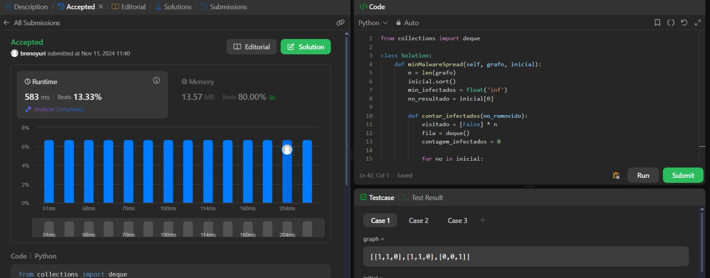
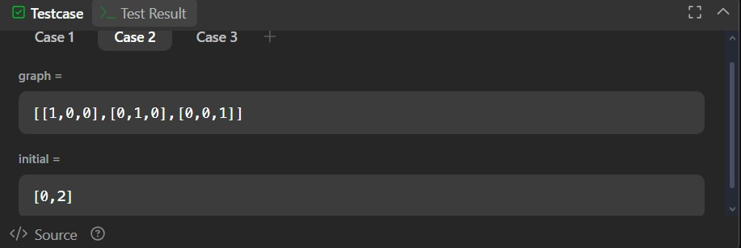
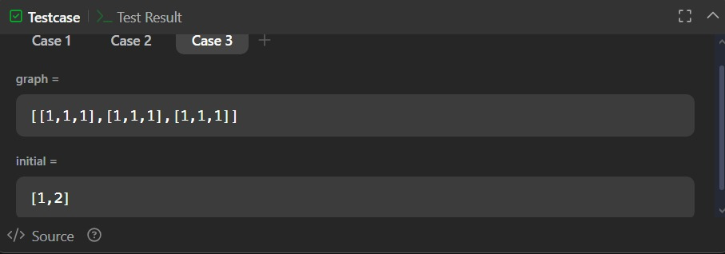

# [924. Minimizar a Disseminação de Malware](https://leetcode.com/problems/minimize-malware-spread/description/)

Você é dado uma rede de \( n \) nós representada por uma matriz de adjacência \( n \times n \), onde o \( i \)-ésimo nó está diretamente conectado ao \( j \)-ésimo nó se graph[i][j] == 1.

Alguns nós estão inicialmente infectados por malware. Sempre que dois nós estão diretamente conectados, e pelo menos um desses dois nós está infectado por malware, ambos os nós serão infectados por malware. Essa propagação de malware continuará até que nenhum nó mais possa ser infectado dessa maneira.

Suponha que \( M(\text{initial}) \) seja o número final de nós infectados com malware em toda a rede após a propagação do malware. Vamos remover exatamente um nó da lista inicial.

Retorne o nó que, se removido, minimizaria \( M(\text{initial}) \). Se múltiplos nós puderem ser removidos para minimizar \( M(\text{initial}) \), retorne o nó com o menor índice.

Note que, se um nó for removido da lista inicial de nós infectados, ele ainda poderá ser infectado mais tarde devido à propagação do malware.

## Exemplos

*Exemplo 1:*

Entrada:  
graph = [1,1,0],[1,1,0],[0,0,1],  
initial = [0,1]

Saída:  
0

*Exemplo 2:*

Entrada:  
graph = [1,0,0],[0,1,0],[0,0,1],  
initial = [0,2]

Saída:  
0

*Exemplo 3:*

Entrada:  
graph = [1,1,1],[1,1,1],[1,1,1],  
initial = [1,2]

Saída:  
1

## Restrições:

- \( n == \text{graph.length} \)
- \( n == \text{graph[i].length} \)
- \( 2 \leq n \leq 300 \)
- \( \text{graph[i][j]} \) é 0 ou 1.
- \( \text{graph[i][j]} == \text{graph[j][i]} \)
- \( \text{graph[i][i]} == 1 \)
- \( 1 \leq \text{initial.length} \leq n \)
- \( 0 \leq \text{initial[i]} \leq n - 1 \)
- Todos os inteiros em initial são únicos.

## Screenshots da Solução

Solução da questão 924

Case 2

Case 3
